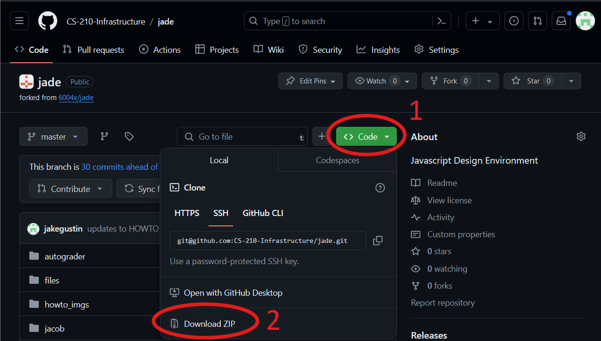
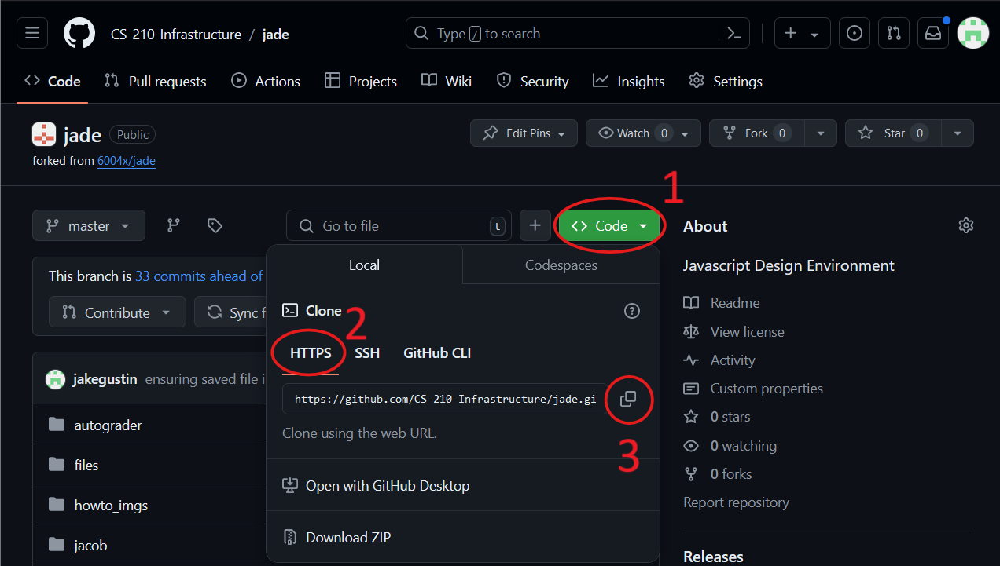
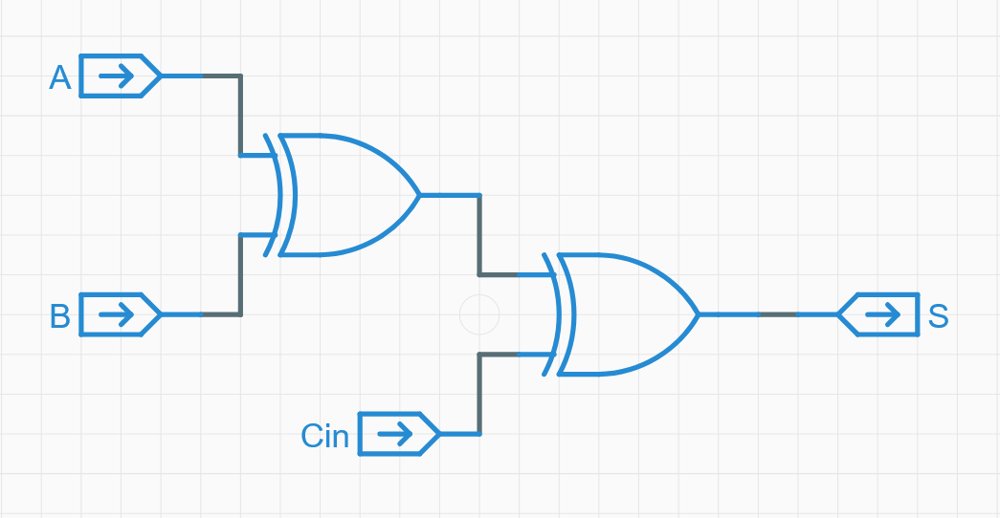
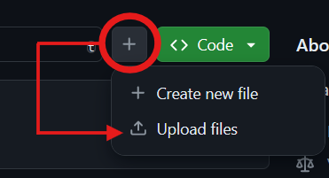
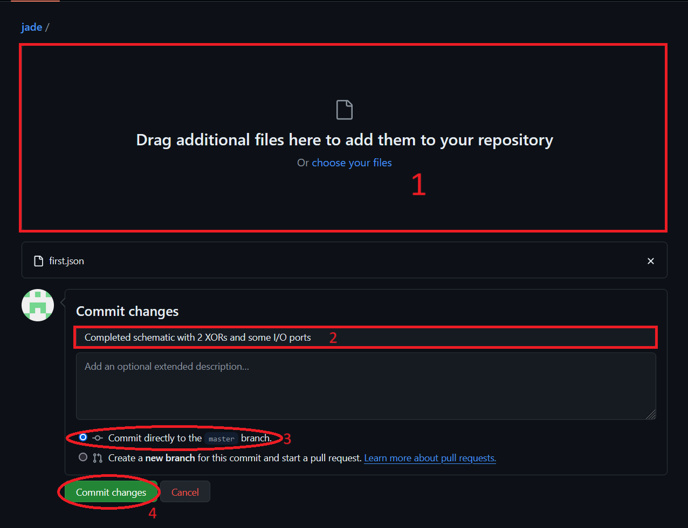
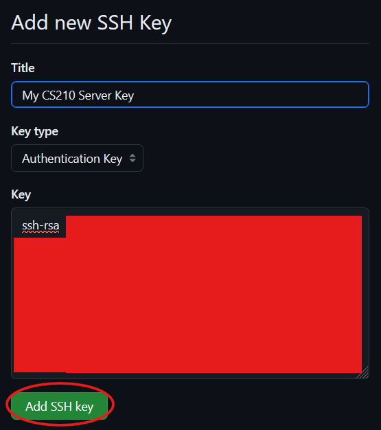
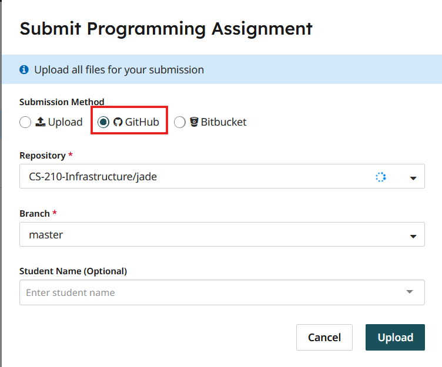
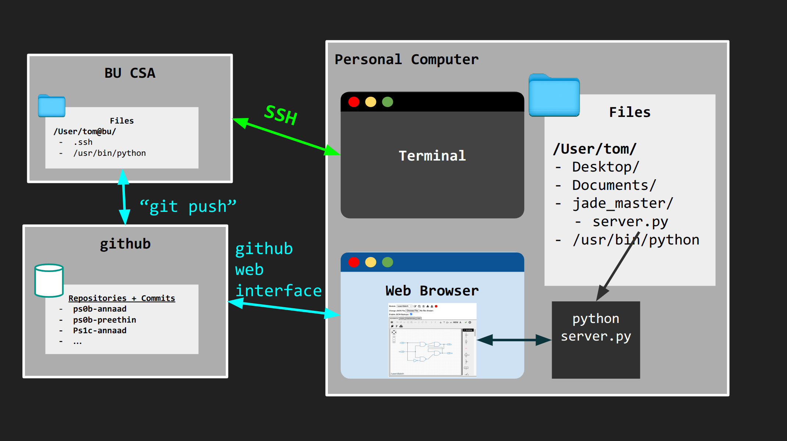

# PS0B: Getting Up to Speed with the CS210 Tools

## Table of Contents

1. [Prerequisites](#prerequisites)
   - [Installing Python](#installing-python)
      - [Windows](#windows)
      - [MacOS](#macos)
      - [Linux / Windows Subsystem for Linux (WSL)](#linux--windows-subsystem-for-linux-wsl)
      - [Verifying Python Installation](#verifying-python-installation) 
   - [Installing Git (Optional)](#installing-git-optional)
      - [Windows](#git-for-windows)
      - [MacOS](#git-for-macos)
      - [Linux / Windows Subsystem for Linux (WSL)](#git-for-linux--windows-subsystem-for-linux-wsl)
      - [Verifying Git Installation](#verifying-git-installation)
2. [Intro to Jade](#intro-to-jade)
   - [Installing Jade](#installing-jade)
       - [Option 1: Downloading the ZIP File](#option-1-downloading-the-zip-file)
       - [Option 2: Cloning the Repository](#option-2-cloning-the-repository)
   - [Task #1: Your First Schematic](#task-1-your-first-schematic)
   - [Committing to Github - Web Interface](#committing-to-github---web-interface)
3. [Intro to UNIX and the Shell Interface](#intro-to-unix-and-the-shell-interface)
   - [Accessing a UNIX Environment](#accessing-a-unix-environment)
      - [Option 1: Logging into BU's CSA Machines](#option-1-logging-into-bus-csa-machines)
      - [Option 2: Using Google Colab/Github Codespaces](#option-2-other-provided)
      - [Option 3: Using Your Local Environment](#option-3-using-your-local-environemnt)
   - [Configuring Your Environment](#configuring-your-environment)
       - [Adding an SSH Key to GitHub](#adding-an-ssh-key-to-github)
       - [Configuring Git in the Terminal](#configuring-git-in-the-terminal)
   - [Task #2: Your First Script](#task-2-your-first-bash-script)
   - [Committing to Github - Terminal](#committing-to-github---terminal)
4. [Submit to Gradescope](#submit-to-gradescope)
   - [Checklist](#checklist)
   - [Submission Instructions](#submission-instructions)
5. [Additional Information](#additional-information)
   - [Extra Git Resources](#extra-git-resources)
   - [Extra UNIX / Bash Resources](#extra-unix--bash-resources)
   - [Grading Comments and Git Commit Histories](#grading-comments-and-git-commit-histories)
      - [Comments](#comments)
      - [Number of Commits](#number-of-commits)
      - [Commit Messages](#commit-messages)

<br/><div style="background-color: #444444; padding: 10px; border: 1px solid #999;">

**NOTE: This document may appear to be rather long. Don't worry, it's just due to a bunch of pictures, a variety of options for getting set up, and an extensive amount of documentation to avoid any confusion. You don't need to remember everything on this document, so feel free to reference it later on when working on other assignments as needed.**

</div><br />

## Prerequisites

### Installing Python

**NOTE**: This prerequisite should be installed on your local machine, as it is a requirement for running the Jade tool discussed later on. Running Jade in the online UNIX server and the BU CSA machines is not supported at this time.

This should be a familiar process for those of you who took CS111, but below are some installation steps in case you haven't got python on your system yet. Do note that Python 3.13 is not compatible with the Jade software used in this course. All other recent versions are compatible.

#### Windows:

- Option 1: Go to the Microsoft Store, search for Python, and install it.
- Option 2: Go to https://www.python.org/downloads/ to download the installer that you can execute

#### MacOS: 

- Option 1: In the 'Terminal' program on your device, run `brew update && brew upgrade`, and then run `brew install python3`
   - If Homebrew isn't installed, use the following command and follow the instructions provided after executing it:  
   `/bin/bash -c "$(curl -fsSL https://raw.githubusercontent.com/Homebrew/install/HEAD/install.sh)"`
- Option 2: Go to https://www.python.org/downloads/ to download the installer that you can execute

#### Linux / Windows Subsystem for Linux (WSL):

Install python through your package manager. Try running the commands `apt`, `yum`, and `dnf` in the terminal to see which you have installed.
   - apt: Run the following...
      ``` 
      sudo apt-get install software-properties-common
      sudo add-apt repository ppa:deadsnakes/ppa`
      sudo apt-get update`
      sudo apt-get install python3
      ```
   - yum: `sudo yum install python3`
   - dnf: `sudo dnf install python3`

#### Verifying Python Installation

Open your terminal / command prompt and enter the command `python3 --version`. In some cases, you can also just run `python --version` instead. Your output should look something like `Python your_version_number`. If you get an error, try going through the installation steps again or ask the course staff for assistance.

### Installing Git (Optional)

**NOTE**: This prerequisite is not particularly *mandatory* as Git is preinstalled in the online UNIX environment and the CSA machines. If you skip this step, then when working with Jade, you must download the installation files in a ZIP file and commit your files through the web interface - committing through the terminal will not be available in your local machine without it. Regardless, we have provided these instructions for your benefit in this class and for outside usage of git.

Installing git onto your local machine is relatively straightforward for most users.

#### Git for Windows: 
   - Download [Git for Windows](https://gitforwindows.org/), run the installer, and follow the instructions.
      - Link: https://gitforwindows.org/
   - If prompted for default editor, choose your favorite code editor.
   - If prompted for adjusting your PATH environment, we recommend Git from the command line and also from 3rd-party software.

#### Git for MacOS: 
   - Open the 'Terminal' program on your device.
   - Run `brew update && brew upgrade`
   - Run `brew install git`.
   - If Homebrew isn't installed, use the following command and follow the instructions provided after executing it:  
   `/bin/bash -c "$(curl -fsSL https://raw.githubusercontent.com/Homebrew/install/HEAD/install.sh)"`

#### Git for Linux / Windows Subsystem for Linux (WSL): 
   - Check which package manager(s) you have: run `apt`. `yum` and `dnf` in the terminal to see if they succeed.
   - If using apt: 
      ```
      sudo apt-get update
      sudo apt-get install git
      ```
   - If using yum:
      - `sudo yum install git`
   - If using dnf: 
      - `sudo dnf install git`

#### Verifying Git Installation
   - Open your terminal / command prompt / Git Bash and run the command `git version`. It should output something along the lines of `git version some_version_number`. If you see an error, try the above steps again or reach out to the course staff for assistance.
## Intro to Jade

### Installing Jade

Jade can be installed in two ways, with both methods effective for getting up and running in a couple of minutes.

#### Option 1: Downloading the ZIP file
1) Go to the repository on the Github webpage
   - Link: https://github.com/CS-210-Infrastructure/jade
2) Click the shiny, green 'Code' button.
3) Click 'Download ZIP'. The ZIP file should start downloading immediately.
4) Extract the contents to a directory of your choosing.



#### Option 2: Cloning the Repository
1) Go to the repository on the Github webpage
   - Link: https://github.com/CS-210-Infrastructure/jade
2) Click the shiny, green 'Code' button.
3) If needed, click the 'HTTPS' tab in the small window that appears
   - If you skipped ahead a bit and have your SSH key set up, you can also use the SSH option instead. Just know that you'll need to clone with SSH to 'commit' to your own repositories in your terminal rather than on the webpage. For this repository though, you will not need to commit any changes.
4) Copy the provided link.
5) Execute the following command in your terminal / command prompt: `git clone the_link_you_copied`
   - By default, your terminal will be in your home directory. This would be `C:\Users\You` for Windows, `/Users/You` for MacOS, and `/home/you` for Linux. Keep this in mind for future instructions in this document.



### Task #1: Your First Schematic

For instructions on how to run Jade, read the Jade repository [README.md](https://github.com/CS-210-Infrastructure/jade/blob/master/README.md). 
Note, that although Jade is a python program, it will only work correctly if you run it from the terminal with the specified command. **Do not use Spyder or a similar python IDE**.

Your first task for PS0B is to recreate the schematic shown below. This will be one of the only times we give you a solution to a problem outright, so enjoy it while you can. :)



The schematic above utilizes 3 input ports: A, B, and Cin, along with one output: S. Two XOR gates are used to create the logic in the schematic. 

Provided as part of this PS0B repository is a first.json file. You should copy this file into the folder where you extracted/cloned Jade into. When starting the python server for Jade, you should specify `first.json` as the JSON file you want to open. The port number can be anything you desire, but we recommend the default port of 8000 for consistency in debugging issues. The [HOWTO.md](./HOWTO.md) document in this repository (and the Jade repository, they're the same thing) should provide you with all the needed information to accomplish this task, such as starting your Jade server, working in Jade, and saving your module/netlist to a file.

You should implement this schematic in the `/user/untitled` module (which should be the default when you open Jade in a web browser). 

The provided file also comes preloaded with the tests for the module. Feel free to have a look around at how the tests are designed, some comments are provided to help in understanding what each individual test means. The autograder for this assignment has its own copy of the tests, so any edits you make to the tests won't impact how the autograder evaluates your schematic. You can run the tests in Jade by clicking on the green checkmark in the toolbar towards the top of the browser window.

### Committing to Github - Web Interface

When you've completed the module, you'll need to utilize the 'Extract Netlist' functionality of Jade to export your work to a file that can be submitted and tested. The name of the file should be `user-untitled-netlist.json` by default for the module `/user/untitled`, but rename it manually if you need to. This is the filename the autograder will be expecting.

You won't be submitting this file directly to Gradescope (as you did in previous courses), but rather storing it in a GitHub repository and submitting the Github repository instead. Below are the instructions on how to commit your file to your repository via the Github website (potentially your very first commit ever, how exciting!). Gradescope submission is discussed later in this document.

1) Navigate to your repository on the GitHub website (this might be through a GitHub Classroom link provided to you by the course staff).
2) Click the "Add Files" or plus button right next to the shiny, green 'Code' button.
3) Select 'Upload Files'.



4) Drag-and-drop your JSON file into the specified area or click 'choose your files' to open your file explorer to select the file.
5) For this assignment, you can use "Completed my first schematic" as a commit message
    - See [here](#commit-messages) for info on what is considered a descriptive commit message going forawrds.
6) Ensure you commit directly to the master / main branch
7) Make the commit!

<div style="background-color: #dd0000; padding: 10px; border: 1px solid #999;">

**IMPORTANT: Future assignments will be graded based upon the number of commits and the descriptiveness of your commit messages, so it's best to get into the habit of writing good commit messages now.**

</div><br />



And that's it: you're done with Task #1 of PS0B. Be sure to look through the rest of the HOWTO.md document as well for future reference and troubleshooting advice when working on future assignments using Jade. For now, let's move onto something different.
    
## Intro to UNIX and the Shell Interface

In CS210, we will be learning about the x86-64 processor and the UNIX operating system.
In previous courses,

In order to facilitate this learning, we all need to be using the same type of computer! To enable this, you will remotely connect to this standard type of machine that will be running Linux on x86-64 processor.

Thus, it doesn't matter what type of CPU or Operating system your personal computer has because we can all connect to this standard machine and run the assignments (needed for PS2 onward)!

### Option 1: Logging into BU's CSA Machines

The BU CSA machines are designed specifically for the CS210 experience to ensure every student is on the same playing field for programming-related assignments. This is especially true for when you begin exploring Assembly, where the code varies widely between the x86-64 architecture (found on most Windows devices, older Mac devices) and the ARM64 architecture (found on newer, M-series Macs). Follow the instructions below in order to sign into the online interface.

To access the BU CSA machines you will need to use **ssh**. 

**SSH** stands for secure shell, and is a protocol that allows you to access another machine's shell over the network. Once you `ssh` into the machine, you will be able to run shell commands (like `pwd`, `ls`, `cd`) in the terminal on the **remote** machine!

1. Most recent versions of MacOS, Linux, Windows, and Windows WSL come with SSH capabilities installed and ready to go. To verify if you have SSH installed, run the `ssh -V` command in your terminal / command prompt to see if you get a version number or an error.
    - For Windows users, in the event SSH is not installed yet, try out the steps [here](https://learn.microsoft.com/en-us/windows-server/administration/openssh/openssh_install_firstuse?tabs=gui). You may not need to meet the 3rd prerequisite of having your user account be in the Administrators group.
2. Run `ssh username@csa1.bu.edu`, replacing username with your BU / Kerberos username, to log in.
    - You can also use csa2 or csa3, they all access the same environment.
3. When prompted for a password, enter your BU / Kerberos password.
4. At this point, assuming there are no errors, you're in! To leave the SSH session, just type `exit` to return to your local machine's shell session.


#### Alternative Options
**The following options should only be used in the case you encounter any issues the BU CSA cannot be resolved. If you are having trouble with SSHing into BU CSA, come to office hours first.**

##### Alternative Option 1: Using Google Colab

The following github colab notebook provides a few cells that setup google colab correctly.
[https://colab.research.google.com/drive/1b6DADdkfC2UlhqI71DEpV0K1WEga1o6-?usp=sharing](https://colab.research.google.com/drive/1b6DADdkfC2UlhqI71DEpV0K1WEga1o6-?usp=sharing)

1. (FIRST TIME ONLY) Run the first two cells in the google colab notebook. 
    - Note that this notebook automatically runs the process described in the "Adding an SSH Key" section. Then, it moves the ssh key to your google drive so that it can be loaded any time you start a new colab session. You will need to copy the ssh public key to github.com as described in the later section.
2. (Second Time and After) Any time your runtime restarts you will need to run the two notebook cells under the "Every Time Your Runtime Resets" title card.
3. Click on the bottom panel's "Terminal" button. You now have access to a linux shell from which you can clone github repositories and do assignments.
4. BE AWARE. When the google colab runtime resets you will **loose all work** in the root + `content/` directory. **Be sure to push to github often!**

##### Alternative Option 2: Using Your Local Environment

<div style="background-color: #dd0000; padding: 10px; border: 1px solid #999;">

**DISCLAIMER: Should you choose this option, the course staff are not responsible for ensuring your system contains the required libraries and programs to complete assignments in this course. You will be responsible for installing those prerequisites as needed. The course staff may not be able to resolve issues pertaining to your own system's configuration.**

</div><br/>

If you feel confident in configuring your own system and installing required libraries (typically libraries in the C programming language) as you go along, you can choose to use your local system to complete work in this course. There are some restrictions however due to the usage of the Intel Assembly Language in this course.

- Allowed (x86_64 architecture):
    - Windows Devices with Intel/AMD Processors
        - Note: You **MUST** use WSL to utilize the bash shell. You can access your Windows "C:/" drive in the directory `/mnt/c` in WSL.
    - MacOS Devices with Intel Processors (Pre-November 2020)
    - Linux Devices with Intel/AMD Processors
- Prohibited (ARM64 Architecture)
    - MacOS Devices with M-Series Processors (November 2020 and onwards)
    - Windows/Linux Devices with ARM64 Processors (typically a Snapdragon CPU or equivalent)

If you decide to take this option, getting started is rather simple.

1. Open your terminal / WSL shell.

And you're ready to go!

### Configuring Your Environment

At this point, your chosen environment is just about ready to go! There are just a few modifications that are needed before your environment can be utilized with git. Follow the steps below to perform the necessary configuration.

**NOTE: The following steps only need to be executed one time. You do NOT have to repeat these steps every time you start a server or log into a server**

#### Adding an SSH Key to GitHub

Run the following commands in a terminal in your online environment.

1. `ssh-keygen`: This will start the creation of an 'RSA' key pair.
2. If prompted for a file to save the key in, just press enter/return to use the default file path.
3. If prompted for a passphrase, just press enter/return to use the default of no passphrase.
4. If prompted to enter the same passphrase again, just press enter/return again.
5. `cat ~/.ssh/id_rsa.pub`: This will output the public key you've created. 
    - Fun fact: `~` is a shortcut / wildcard character that is equivalent to your home directory. For the online environment, `~/.ssh` is the same as `/home/jovyan/.ssh`. It's useful to know for getting around the terminal quickly. Despite the naming , `~` is **NOT** equivalent to `/home/`.
6. Copy the entire output of the previous command.

Example Input/Output:
```
$ ssh-keygen
Generating public/private rsa key pair.
Enter file in which to save the key (/home/jovyan/.ssh/id_rsa):
Enter passphrase (empty for no passphrase):
Enter same passphrase again:
Your identification has been saved in /home/jovyan/.ssh/id_rsa
Your public key has been saved in /home/jovyan/.ssh/id_rsa.pub
The key fingerprint is:
SHA256:ABunchOfRandomLettersAndNumbers
The key's randomart image is:
+---[RSA 3072]---+
|                |
|   Random       |
|                |
|     Characters |
|                |
|                |
|   Here         |
|                |
|                |
+----[SHA256]----+
$ cat ~/.ssh/id_rsa.pub
ssh-rsa YourPublicKeyHere
```

Now, let's register the public key with your GitHub account.

7. Go to https://github.com and log into your account.
8. Click your profile avatar (typically on the top right) and go to Settings.
9. On the left hand side (or on the top if you're on mobile or have a small browser window), select 'SSH and GPG Keys'
10. On the top right, select 'New SSH Key'.


11. Give your key a fun title! It won't impact how the key works.
12. Confirm the key type is an Authentication Key
13. Paste the previously copied public key into the provided text box.
14. Click 'Add SSH Key' and complete 2-factor authentication if necessary



With that, you should be good to go to clone repositories via SSH. But we need to make one more adjustment to commit to those repositories in the terminal.

#### Configuring Git in the Terminal

We just need to run a few commands in the terminal so the local Git program knows who you are when you make your commits.

1. `git config --global user.name "First Last"`, replacing First Last with your name: Sets the local username to your name.
2. `git config --global user.email "you@example.com"`, replacing the email with the email associated with your GitHub account (may or may not be your BU email): Sets the local email to the inputted email address.
3. `git config --global user.name`: Should output the current value of user.name, which should now be your name. Try Line #1 again if the output is blank or incorrect.
4. `git config --global user.email`: Should output the current value of user.email, which should now be the email address you inputted. Try Line #2 again if the output is blank or incorrect.

### Task #2: Your First Bash Script

**You are not expected to understand what all of these commands and
steps are doing yet.** But hopefully, as you do them, you will get curious
about the commands and what you observe in response to them.  

**NOTE: A few of the commands will produce error messages.  This is on purpose.  We have done this so that you can get curious about what the following commands do to correct the error and why they are needed.**

For the moment, following the instructions below like a recipe is OK.
Doing so will get your fingers and brains familiar with the bread-and-butter steps of working in a UNIX environment.  It will also help us ensure you are set up correctly. As you continue working on assignments in CS210, some of these commands will become more and more familiar to you.

Run the following commands in your terminal. An explanation of what each line is provided for understanding.

1. `pwd`
    - Outputs your current working directory to a file stream known as 'standard output'. In this case, standard output just goes to your terminal screen.
2. `git clone git@github.com:<repository-name>.git` where you replace `<repository-name>` with the name of the repo created by the github classroom link. On the github website, there is a green "Code <>" button, and under the "ssh" tab you can find the exact command to copy with your repo name. Then, if you see a message **Are you sure you want to continue connecting?**, type yes in your current terminal.
    - Clones your repository on Github into your local device so you can work with it locally. You can think of 'cloning' as 'creating a local copy'.
3. `cd ps0b-username` where you replace `username` with your GitHub username. 
    - `cd` stands for 'change directory'. We're asking the shell program to go to directory `ps0b-username`. If there is no prefix, such as  `/` (root directory), `./` (current directory), or `../` (parent directory), we assume the directory is a subdirectory of your current working directory.
4. `pwd`
    - See line #1. You should notice that the output you see has changed to reflect the new working directory as a result of the previous `cd` command.
5. `ls -l`
    - `ls` lists the contents of the current working directory. The -l flag provides additional information about the directory's contents.
6. `echo '#!/opt/conda/bin/python' > hello`
    - `echo` normally takes the input and prints it back out to the terminal or whatever device is connected to standard output. However, `>` is a redirection operator that creates/overwrites the file `hello` with the output of the command(s) to the left of it (`echo '#!/opt/conda/bin/python'`).
7. `echo 'print("Hello World!!!")' >> hello`
    - Similar to the above command, but `>>` is a redirection operator that appends the output to the file `hello` rather than completely overwriting it. It will create the file if needed as well.
8. `ls -l`
    - See line #3. You should notice a new entry in the directory listing, showing the new `hello` file.
9. `cat hello`
    - `cat` takes in the name of a file as an argument and then prints the contents of that file to the terminal / standard output.
10. `./hello`
    - This is how you would normally execute a script or another executable program: by entering the path to the program. The `.` operator is a handy operator that is equivalent to the current working directory. In this case, we want to run the file `hello` in the current directory. However, we're going to run into an issue.
11. `chmod +x hello`
    - `chmod` modifies the permissions of some file. In this case, the `+x` argument means we want to add 'execute' permissions to the target file, in this case `hello`.
12. `ls -l`
    - See line #3. Check out the permission bits next to the `hello` file on the left side of `hello`'s entry. You should notice a new 'x' bit compared to the previous time you ran this command, indicating the file is executable.
13. `./hello`
    - Attempting to run the `hello` script again, and it *should* work.
14. `hello`
    - Without the path name, the shell has to look in the directories in its 'PATH' variable to see if there is a program by the name of hello, and if so, runs the program at the corresponding path. However, our current directory isn't in the PATH variable yet, so this should fail.
15. `export PATH=$PATH:$PWD`
    - `export` is used for setting environment variables in the shell program. In this case, we're leveraging variable expansion, where `$PATH` would 'expand' to the value of that special variable in the shell program, typically a series of directories separated by colons, and `$PWD` would expand to the path of the current working directory. In other words, we're concatenating the existing PATH variable with the current directory.
16. `hello`
    - See line #12. With the current directory in the PATH variable now, this should work!
17. `cat testhello.sh`
    - See line #7. Outputting the contents of testhello.sh to the terminal / standard output.
18. `cat testhello.sh | wc`
    - The `|` operator is also known as a pipe. It does a nice party trick of taking the output of the command(s) to the left of it and using it as the input / standard input stream for the command(s) to the right of it. `wc` is a program that looks at how many lines, words, and characters are in a given file provided as input. Since we're using a pipe though, we don't need to specify an input for `wc`, as it just uses the input provided by the pipe instead.
19. `./testhello.sh ./hello`
    - Running the `testhello.sh` script with a command-line argument of `./hello`

In step 19 above you ran the same test script that the autograder will use.  It confirms that the hello "program" you wrote works as expected.  If you don't see it pass, then please carefully repeat the steps.  If you are still having trouble, come to office hours if you need help.

<div style="background-color: #dd0000; padding: 10px; border: 1px solid #999;">

**IMPORTANT: Your work and files on the online server are NOT permanently saved. The online server will automatically reset itself after 12 hours of inactivity, erasing all files stored on the server (excluding ssh and git configuration settings). Be sure to commit and push your changes to GitHub in order to ensure that your work is saved.**

</div><br />

You're almost done! Keep your terminal open and proceed to the next section to commit and push your changes.

### Committing to Github - Terminal

When working with the terminal, there are three steps you need to do in order to save your work to GitHub.

1. `git add hello`: Adds a file or a set of files to be 'staged' for a commit. In this case, we're staging the hello file for a commit.
    - Advanced Usage: `git add file1 file2 file3` stages multiple files for a commit in one command.
    - Advanced Usage: `git add dir1` stages all modified files in directory 'dir1' for a commit.
2. `git commit -m "my cool hello program"`: Creates a commit with the staged files. The -m option allows you to specify a commit message
    - The message used in the above example is fine for PS0B. See [here](#commit-messages) for info on what is considered a descriptive commit message going forwards.
3. `git push`: Sends your committed changes to the remote repository on GitHub. At this point, assuming you don't have any errors, your changes have been saved! Check out your repository on the website to confirm the new changes were made.
    - If you get an error regarding git failing to push some refs, try the following: `git push -u origin main` or `git push -u origin master`. You should only need to do this once.

<div style="background-color: #dd0000; padding: 10px; border: 1px solid #999;">

**IMPORTANT: Future assignments will be graded based upon the number of commits and the descriptiveness of your commit messages, so it's best to get into the habit of writing good commit messages now.**

</div><br />

While many code editors feature built-in support for version tracking, such as in Visual Studio Code, the command `git status` is helpful for confirming what files have been modified according to git and what files are currently staged for a commit.

## Submit to Gradescope

You've made it to the end of PS0B! Let's wrap this thing up and upload your repository to a Gradescope submission.

### Checklist

- `user-untitled-netlist.json`: Your netlist file from Task #1
- `hello`: Your hello file from Task #2
- The other files you started with in your PS0B repository: No need to delete these files.

### Submission Instructions

1. Sign into Gradescope
2. Navigate to the PS0B submission site
3. Be sure to select Github as your submission method
4. Select your desired repository, which should be your PS0B repository (and NOT the Jade repository) 
5. Select the branch to use, which most likely will be the master/main branch for you. 
6. You won't have a Student Name option, that's for instructors only.
7. Upload the submission!


**NOTE: Be sure to verify that your submission was made, and that the files in your submission are up to date. The instructors will always assume the work on Gradescope is your best effort up to that point and have the right to refuse to update your submission after the deadline(s)**



## Additional Information

### Extra Git Resources

See the below resources for additional information about how to use git. This class will primarily be using `git clone`, `git add`, `git commit`, and `git push`, though in the event there is an assignment that can be worked on in teams, `git pull` can be useful. `git status` is also helpful to use when in the process of committing to verify which files are staged for a commit.
- https://git-scm.com/docs/gittutorial
- https://www.w3schools.com/git/default.asp
- https://www.freecodecamp.org/news/guide-to-git-github-for-beginners-and-experienced-devs/
- Run `git help` in the terminal for a list of available commands.
- Run `git subcmd help`, replacing subcmd with a subcommand such as add, commit, or push, to see a detailed manual for a specific subcommand's usage.

### Extra UNIX / Bash Resources

Most of the needed shell functionality for this course has been covered as part of PS0B (navigating the filesystem with `ls`/`pwd`/`cd`, running programs, types of relative paths, and some special characters / variables). See below for additional information about the bash shell environment.
- https://missing.csail.mit.edu/
- https://www.gnu.org/software/bash/manual/bash.html
- https://linuxconfig.org/bash-scripting-tutorial-for-beginners
- https://www.freecodecamp.org/news/linux-command-line-bash-tutorial/
- Run `help` in the terminal for a list of available commands that can be utilized with bash.
- Running `man command` (if a manual page is available) and `command --help`, replacing "command" with the command you want information on, can provide detailed usage info about a command.

### Grading Comments and Git Commit Histories

Most, if not all of your programming assignments (i.e. PS1B, PS2B, etc.) will have a 'Comments' and 'Git Commit History' component to the grading. Comments are typical inline code comments you've likely utilized in prior courses that describe the functionality of certain segments of code. In addition, git commits serve as snapshots of your codebase at various points in time and are primarily used to track your progress throughout an assignment, though they do offer other benefits that won't be explored in depth in this class. For this class however, comments are utilized to ensure you have an understanding of the code you've submitted, while commits are utilized to ensure that you're completing your work in iterations and to help you familiarize yourself with GitHub and the `git` tool, which is an industry-standard tool utilized for version control.

### Comments

The desired number of comments can vary for every assignment, but in general, the advice is "the more comments, the better". 

For Assembly code, particularly the first Assembly assignment (Assembly Fragments), it may be best for you to write a comment for each line of Assembly code to show the graders that you understand what each line of Assembly code is doing, as it is likely a new programming language for you.

As you go on to more complex Assembly assignments and C assignments, you should instead focus on describing the code at a higher level, indicating what each function, loop, and conditional does. You are more than welcome to add additional comments as you deem necessary, but you certainly don't need to write a comment for every line of code.

#### Number of Commits

Similar to comments, the general advice is "the more commits, the better". Some assignments may specify a minimum number of commits (i.e. one commit for each module or code fragment), but for maximum points, you should also create intermediate commits where applicable. Instances where you make a commit solely to save your progress to continue at a later time are considered a valid commit as well. Don't go overboard though, you do not need to make hundreds of commits for full credit!

Often times in an industry / academia environment, if the code in a commit isn't working as expected with the rest of your code, you could use `git revert` to undo the changes of a particular commit. This only works well assuming your git commit history is of a sufficient length and granularity in the sense that you could replace certain sections of code efficiently as needed. If you rarely commit, you might remove more functionality than desired by reverting, forcing you to rewrite some code!

#### Commit Messages

For this class (and most of the time in industry and academia), you'll be writing commit messages to go along with the commit itself to describe the changes you've made, so it's best to get into the habit of writing good commit messages now while you're still in a learning environment. These should generally be no longer than a sentence or two and should provide a sufficiently detailed overview of the changes you've made in the code. Below are some examples of commit messages and how they would likely be evaluated by graders:

- Full Credit
    - **Fixed standard output errors in sendInfo**: Simple, yet effective. Describes the location in the code where the changes are being made (presumably some function/section titled 'sendInfo') and describes what changes were made (code related to 'standard output' functionality).
    - **Update code.s to move numIters and isUpper declaration to data section**: A small change, but extremely descriptive. This message establishes the movement of specific variable declarations from some old location (which would be shown by the 'diff' command of `git`) to a new location: the 'data section' (typically referring to Assembly code).
    - **Still trying to debug segmentation fault with myPtr variable**: This message indicates that the current state of the code is still a work in progress (which is okay!), but changes were made to resolve a segmentation fault error involving the myPtr variable.
- Partial Credit
    - **Starting myFragment**: This is fine for your first commit towards a particular problem or subproblem, but only mentioning the section of your code you're changing in subsequent commits is not likely to be received well by graders due to the potential ambiguity of your changes.
    - **Fixing loop issue**: Loops and conditionals are a frequently utilized tool in programming, so this doesn't particularly provide the needed context to determine the exact issue is being addressed.
    - **Added comments to myCode.c**: While it does provide an overview of the changes made (comments being added), it doesn't describe what kinds of comments were made. This may be okay for smaller files, but for larger, more complex pieces of code, you should mention what the comments made are related to.
- Minimal / No Credit
    - **Updated myCode.c**: This commit doesn't explain what changes were made in the code, only that myCode.c was updated (which GitHub / `git` already tells us about anyways)
    - **Add files via upload**: This is the default commit message when you upload your new files via the web interface and is insufficient for detailing the changes you've made. Be sure to write your own commit message!
    - **Still failing the test**: We don't know what fixes were attempted nor what kind of test is being referred to by this message, leaving the changes associated with this commit as an unknown without further investigation.

## Summary

What did we just do!? Where does everything live?

CS210 has fairly complicated infrastructure. When interacting with it, it is important to understand **where** all these files and tools live. The diagram below summarizes what you just did!



Notice:
- **Python** lives on your local machine
    - We run the jade server on your local machine and use your web browser to visualize it.
- **Github** is the host of all your assignment code and commits.
    - You can access github through the web interface at github.com or, after setting up an ssh key, through the BU CSA terminal.
- **BU CSA** machine is where you will do your assignments. The terminal on your local computer contacts this machine and runs shell commands on the BU CSA machine via SSH.
    - Notice: the .ssh keys live on BU CSA machine because BU CSA communicates with the github servers to push your code changes and commits!

---
### And that's it, you're up to speed with CS210! 

### Happy Programming!!
---
<br />

Fun fact: You can change the shell prompt "PS1" variable to something other than the default. Here's some examples:
- `export PS1="\u:\w$ "`
    - A simple prompt showing your username and your current working directory with a dollar sign ($) prompt.
- `export PS1="\[\e[1;32m\]\u:\[\e[1;34m\]\w\[\e[0m\]$ "`
    - A colorful version of the above with green and blue.
- `export PS1="\u@\h:\w> "`
    - A prompt showing your username, the machine's hostname, and your current directory with an arrow (>) prompt.
- `export PS1="\[\e[1;31m\]\u@\h:\[\e[0;37m\]\w\[\e[0m\]> "`
    - A colorful version of the above with red and light gray.
- `export PS1=`
    - Would you rather have no shell prompt *at all*? You can remove it with this.
- `source ~/.bashrc`
    - Return to the default prompt.

